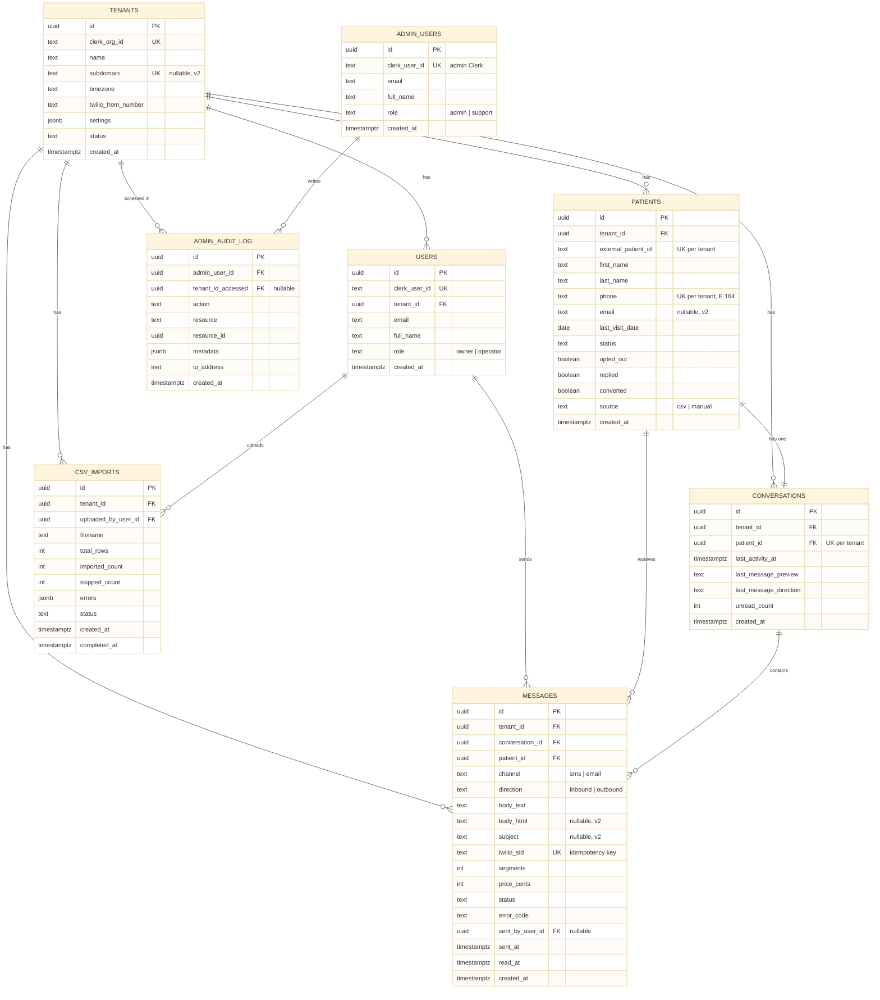

# AURA — Database schema (ERD)

Entity-relationship diagram for the v1 schema. All eight tables, every foreign key, and crow's-foot cardinality.

This maps 1:1 to `lib/db/schema.ts` — each entity is a Drizzle `pgTable`, each `FK` is a `.references()`, and each `UK` is a unique or partial-unique index. The per-tenant uniqueness markers (`patients.phone`, `patients.external_patient_id`, `conversations.patient_id`) are **partial** indexes — unique only where the value is non-null.

> The `%%{init}%%` line at the top of the diagram below sets the font size to 18px so column names are easy to read. GitHub and recent VS Code mermaid extensions both honor it. To adjust, change `fontSize` — e.g. `'16px'` for slightly smaller, `'20px'` for larger.

## Reading notes

- `tenants` is the hub. Six tables carry a `tenant_id` FK back to it — that column is what every Row-Level Security policy filters on.
- `tenant_id` is denormalized onto `messages` even though `messages` already reaches a tenant via `conversation_id`. This is deliberate: RLS policies must filter on a `tenant_id` column present **on the table itself**, not via a join.
- `patients` to `conversations` is a strict one-to-one, enforced by the unique index on `conversations(tenant_id, patient_id)` — not just convention.
- `messages.sent_by_user_id` is nullable: inbound messages and automated sends have no operator.
- `admin_users` has no `tenant_id` — internal staff are not tenant-scoped. `admin_audit_log.tenant_id_accessed` is nullable because tenant-list views touch no specific tenant.

## Rendering

This file renders as a diagram automatically on:

- **GitHub** — native mermaid support in any `.md` file, no setup.
- **VS Code** — install the *Markdown Preview Mermaid Support* extension, then open the markdown preview (`Cmd/Ctrl + Shift + V`).
- **Most static-site generators** (MkDocs Material, Docusaurus, etc.) — mermaid is built in or a one-line plugin.

If a viewer doesn't support mermaid, the diagram falls back to a readable fenced code block.

## Adjusting readability

- **Font size** — change `fontSize` in the `%%{init}%%` line at the top of the diagram. Mermaid applies one size to the whole diagram; it does not support bolding or sizing column names independently of their types.
- **If you need true per-element styling** (bold column names, larger headers) — render the diagram to a static `.svg` once and edit its CSS. The trade-off is that it stops being a live, editable mermaid block, so do this only once the schema is frozen.
